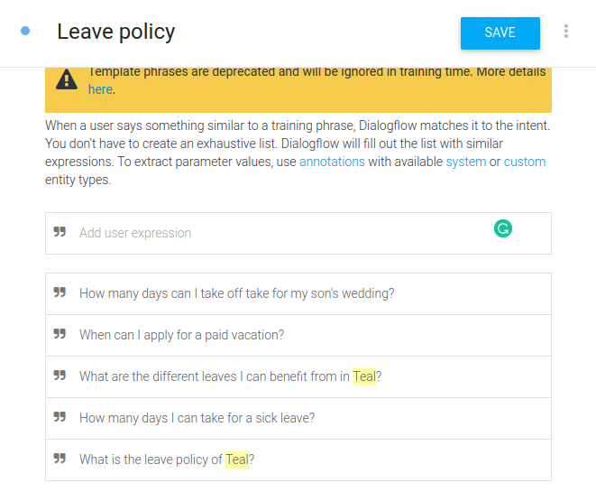

# Teal Chatbot Server App

The server app for Teal's chatbot is an API that answers chat questions using a two-steps pipeline. The first step consists of detecting the intent of the questions using DialogFlow, and the second one is finding the answer in the HR manual of Teal using a question answering neural network (separate [API](https://github.com/MohamedMOUMOU/BERTQA_SQUADV2_API)).

## Technology Stack
- Apollo Server
- MongoDB
- DialogFLow

## Installation

Download or pull the project to your local machine and run the following commands.

```sh
cd  TealChatbotServer
npm i
```
 Before running the server, you should add an .env file at the root directory containing authentication information to your Azure Active Directory client app. Please follow this [link](https://ecfmg.gitbook.io/azure-serverless-quickstart/application-design/adding-authentication/aad-application) to create both the client and server AAD apps.
 
 ## .env File
 
 The .env file contains the following variables (You have to keep the naming consistent).
 
- AAD_TOKEN_OPEN_ID_CONNECT_METADATA_DOCUMENT: a [URL](https://login.microsoftonline.com/common/v2.0/.well-known/openid-configuration) directing to a key pool used to find the public key to decode the Azure token coming from the client to authenticate a user;
- AAD_TOKEN_AUDIENCE: The ID of the Azure Active Directory server app, e.g. api://exxxxxxx-1xxx-4xxx-9xxx-9xxxxxxxxxxxx;
- AAD_TOKEN_TENANT_ID: The ID of the organization, e.g. https://sts.windows.net/exxxxxxx-cxxx-4xxx-axxx-6xxxxxxxxxxx/;
- REACT_APP_AFTER_LOGIN_REDIRECT_URI: The redirection URI after logging in (http://localhost:3000)
- APOLLO_PLAYGROUND_URI = http://localhost:4000/graphql ;

## DialogFlow Connection
To configure a connection between dialogflow and this API, follow these steps:
- Create a DialogFlow app;
- In google cloud, and under the dialogflow app project, create a service account;
- Enable the DialogFlow API under the service account;
- Under the service account create a key in a json format;
- Download the file with the credentials, name it "tealagentCredentials.json," and move it under the src/auth directory;

For demo purposes, add an intent to the Dialogflow app with the name "Leave policy", and add some few questions for training (The screensot below gives an example).



## The question answering API
Follow the steps indicated in the following [Readme file](https://github.com/MohamedMOUMOU/BERTQA_SQUADV2_API) to run the question answering api.

## Seeding
Before running the server, execute the following command to run the seeds.
```
npm run seed
```
## Running the server

```
cd TealChatbotServer
npm run dev
```